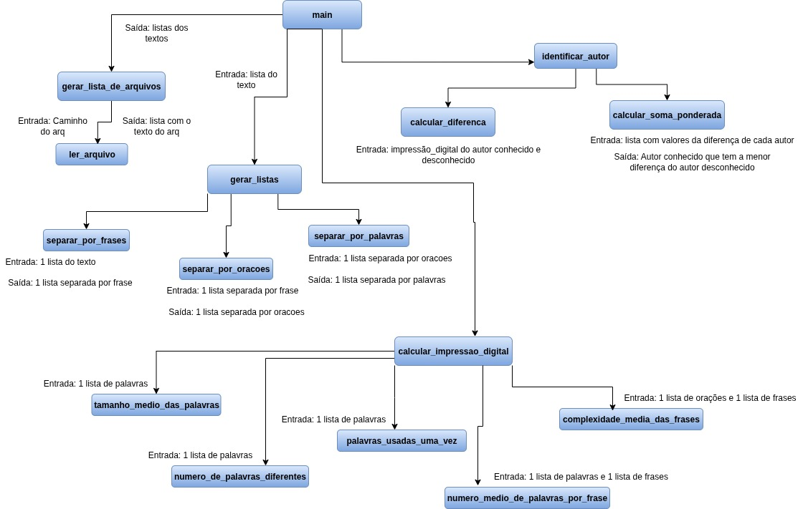

# Decomposição de Problemas (Top-Down)

A **decomposição de problemas** divide o problema principal em sub-problemas menores e mais fáceis de resolver, seguindo uma abordagem hierárquica (top-down).

A imagem abaixo ilustra a decomposição do problema, mostrando o fluxo de dados e a divisão de responsabilidades entre os diferentes módulos do projeto.



---
### Análise de Autoria de Textos

Este projeto tem como objetivo identificar a autoria de um texto desconhecido, comparando-o com textos de autores conhecidos. A análise é feita a partir da **impressão digital** de cada autor, calculada com base em diversas métricas.

---

### Estrutura do Projeto

O projeto está organizado da seguinte forma para facilitar a leitura e a manutenção do código:

- `app/`: Contém todo o código-fonte da aplicação.
    - `__init__.py`: Indica que `app/` é um pacote Python.
    - `main.py`: O ponto de entrada do programa, que orquestra todas as operações.
    - `gerador_listas.py`: Módulo para a leitura e gerenciamento dos arquivos de texto.
    - `processador_texto.py`: Módulo responsável pela divisão do texto em frases, orações e palavras.
    - `calculadora_metricas.py`: Módulo para o cálculo das cinco métricas da impressão digital.
    - `identificador_autor.py`: Módulo para a lógica de comparação e identificação do autor desconhecido.
- `dados/`: Armazena os arquivos de texto utilizados para análise.
    - `autores_conhecidos/`: Textos de autores com autoria confirmada.
    - `desconhecido1.txt`: Texto de autoria desconhecida.
    - `desconhecido2.txt`: 
    - `desconhecido3.txt`: 
    - `desconhecido4.txt`: 
- `testes/`: Diretório para os testes do projeto.
- `venv/`: Ambiente virtual do projeto para gerenciamento de dependências.

---

### Como Rodar o Projeto

Siga os passos abaixo para executar o projeto:

**1. Clone o Repositório:**
```bash
git clone https://github.com/AndreiaJSilva/Decomposicao_de_problemas.git
```

**2. Crie e ative o ambiente virtual**
```bash
python -m venv venv
#### Ative o venv:
#### Windows:
venv\Scripts\activate
#### Linux/macOS:
source venv/bin/activate
```

**3. Instale as dependências**
```bash
pip install -r requirements.txt
```
**4. Execute o programa:**
```bash
pip python app/main.py
```

Ao rodar o programa, você verá a impressão digital de cada autor conhecido, a impressão digital do texto desconhecido e o nome do autor identificado, como no exemplo abaixo:

```bash
Impressões Digitais de Autores Conhecidos:
  Arthur_Conan_Doyle: [4.49, 0.05, 0.045, 23.333, 1.25]
  Charles_Dickens: [4.582, 0.046, 0.043, 24.32, 1.15]
  Jane_Austen: [4.542, 0.045, 0.041, 25.12, 1.34]
  Mark_Twain: [4.394, 0.051, 0.05, 21.99, 1.1]

Impressão Digital do Autor Desconhecido: [4.584, 0.045, 0.042, 24.4, 1.125]

Soma ponderada de Arthur_Conan_Doyle: 0.20
Soma ponderada de Charles_Dickens: 0.15
Soma ponderada de Jane_Austen: 0.22
Soma ponderada de Mark_Twain: 0.18

Autor Desconhecido identificado como: Charles_Dickens
```
---
### Como Rodar os Testes
Os testes são feitos utilizando a biblioteca **pytest**.

Execute o comando:
```bash
pytest
```